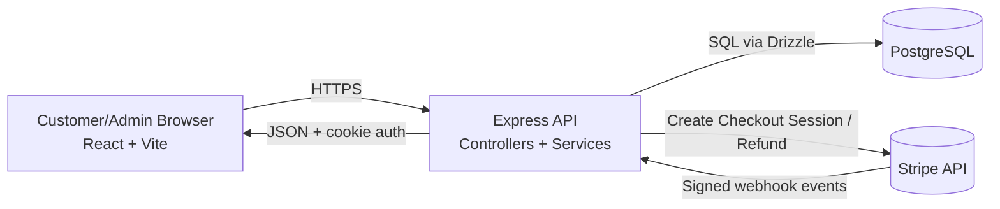
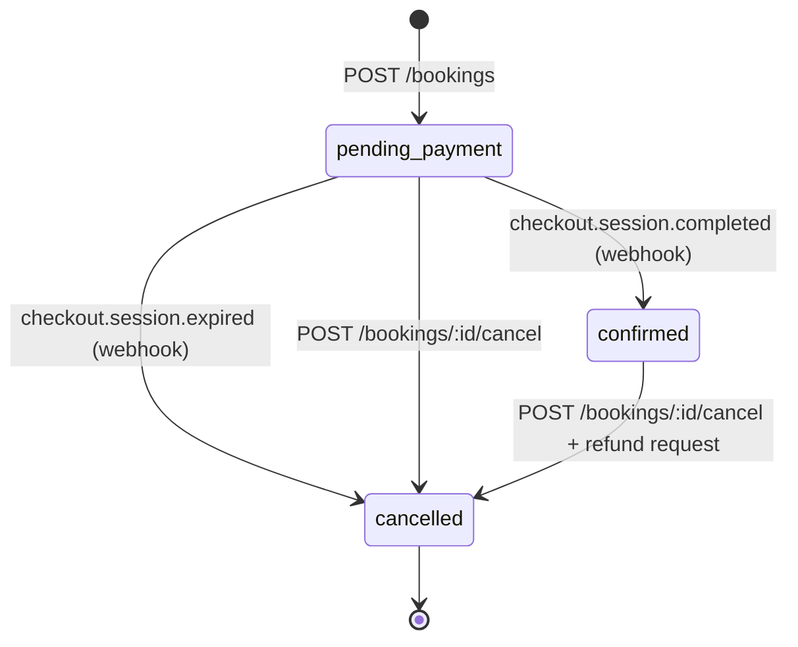
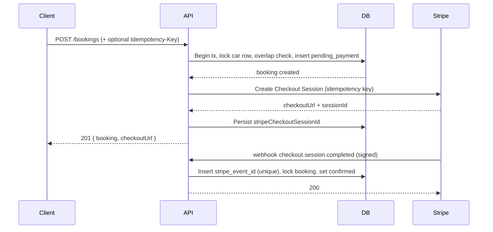

# Car Rental Architecture

## System Overview

- Frontend: React + Vite + MUI, cookie-based authenticated API client.
- Backend: Express + TypeScript, domain services, transactional booking logic.
- Database: PostgreSQL via Drizzle ORM.
- Payments: Stripe Checkout for payment collection, Stripe webhooks for authoritative payment state changes.

## Component Responsibility Matrix

| Component | Owns | Does Not Own |
|---|---|---|
| Frontend | UI, form submission, redirect to checkoutUrl, user feedback | Payment truth, booking confirmation authority |
| Backend controllers | Input validation, auth checks, response shaping | Deep business invariants |
| Backend services | Locking, overlap rules, idempotency semantics, Stripe orchestration | UI behavior |
| Stripe webhooks | Payment completion/expiry events (authoritative signal) | User-facing session state |
| Database | Durable source of booking/inventory state and dedupe records | External payment execution |

## High-Level Components

- Frontend pages and API client:
  - Initiates booking creation.
  - Redirects to Stripe Checkout.
  - Shows pending payment / confirmed / cancelled states.
- Backend HTTP layer:
  - Routes + controllers validate input and authorize user access.
  - Services enforce business invariants and lock/transaction behavior.
- Persistence layer:
  - Relational tables for cars, users, bookings.
  - Additional tables for idempotency and webhook event dedupe.
- Stripe boundary:
  - Outbound API calls for Checkout Session and refunds.
  - Inbound signed webhook events for payment state transitions.

## Booking State Machine

States:

- pending_payment
- confirmed
- cancelled

Transitions:

- Create booking: none -> pending_payment
- Payment success webhook: pending_payment -> confirmed
- Checkout expired webhook: pending_payment -> cancelled
- User/admin cancel:
  - pending_payment -> cancelled
  - confirmed -> cancelled + refund initiation

State authority:

- Stripe webhook is the source of truth for payment completion.
- Frontend redirect parameters are UX signals only.

## State Transition Table

| Trigger | From | To | Guard/Condition | Side Effects |
|---|---|---|---|---|
| POST /bookings | none | pending_payment | No overlap on confirmed/pending_payment bookings | Insert booking, create checkout session |
| checkout.session.completed | pending_payment | confirmed | Valid signed webhook + event not processed before | Store payment intent id |
| checkout.session.expired | pending_payment | cancelled | Valid signed webhook + event not processed before | Release reservation |
| POST /bookings/:id/cancel | pending_payment | cancelled | Owner/admin and not already cancelled | Mark cancelled |
| POST /bookings/:id/cancel | confirmed | cancelled | Owner/admin and not already cancelled | Mark cancelled, initiate refund |

## Concurrency and Consistency Strategy

Primary goals:

- Avoid double-selling a car/date slot.
- Prevent stale-state races between modify and cancel operations.

Mechanisms:

- Anchor lock on the car row during booking creation/modification decision windows.
- Overlap checks block against both confirmed and pending_payment bookings.
- Transactional lock ordering in modify/cancel paths to avoid state flip races.
- Stripe network calls are performed outside DB transactions to keep lock windows short.

## Locking Order Reference

| Operation | Lock Sequence | Why |
|---|---|---|
| Create booking | cars row (anchor) -> overlapping bookings rows | Serializes same-car booking attempts and prevents double-sell |
| Modify booking | target booking row -> cars row (anchor) -> overlapping bookings rows | Prevents stale status/date races while checking new overlap |
| Cancel booking | target booking read -> cars row (anchor) -> update booking | Prevents modify/cancel interleaving inconsistencies |

## Create Booking Sequence

## Idempotency Layers

1. Application idempotency
- Endpoint: POST /bookings
- Key: Idempotency-Key request header
- Store: booking_idempotency table (scoped by user + key)
- Behavior:
  - Same key + same request body returns cached success response.
  - Same key + different request body returns conflict.

2. Stripe API idempotency
- Checkout and refund calls include Stripe idempotency keys.
- Protects against duplicate external side effects during retries.

3. Webhook idempotency
- Store: stripe_events with unique stripe_event_id.
- Duplicate deliveries are acknowledged with success but treated as no-op.

## Idempotency Coverage Table

| Layer | Scope | Key | Duplicate Result |
|---|---|---|---|
| Application | POST /bookings | userId + Idempotency-Key + request hash | Return cached 201 response |
| Stripe API | Checkout/refund API call | Stripe idempotencyKey | Stripe reuses prior effect/result |
| Webhook processing | Incoming Stripe event | stripe_event_id unique constraint | Return 200 and skip reprocessing |

## Security Boundaries

Authentication and authorization:

- JWT token via Authorization header or httpOnly cookie.
- Admin-only routes guarded by role checks.
- Booking ownership rules enforced for customer actions.

Stripe webhook trust boundary:

- Signature verification required (stripe-signature + webhook secret).
- Webhook route mounted before JSON parsing and uses raw request bytes.

## Core Data Model

- cars
  - Rental inventory and pricing source.
- users
  - Authenticated principals with admin/customer roles.
- bookings
  - Date range, price, status, hold expiry, Stripe linkage fields.
- booking_idempotency
  - Request hash and cached response for create-booking retries.
- stripe_events
  - Processed event registry for webhook dedupe.

## Operational Notes

- Configure Stripe webhook secret from stripe listen output in local development.
- Ensure one intended backend target receives webhook forwarding in tests.
- Keep booking hold window and overlap semantics aligned with product behavior.

## Typical Request Flows

Create and pay booking:

1. Authenticated user calls POST /bookings.
2. Service reserves slot and creates pending_payment booking.
3. Service creates Checkout Session and returns checkoutUrl.
4. User completes payment in Stripe Checkout.
5. Stripe sends checkout.session.completed webhook.
6. Webhook marks booking as confirmed under transaction + lock.

Cancel booking:

1. Authenticated owner/admin calls POST /bookings/:id/cancel.
2. Service locks and transitions booking to cancelled in DB.
3. If previously confirmed and payment exists, service requests Stripe refund with idempotency key.
